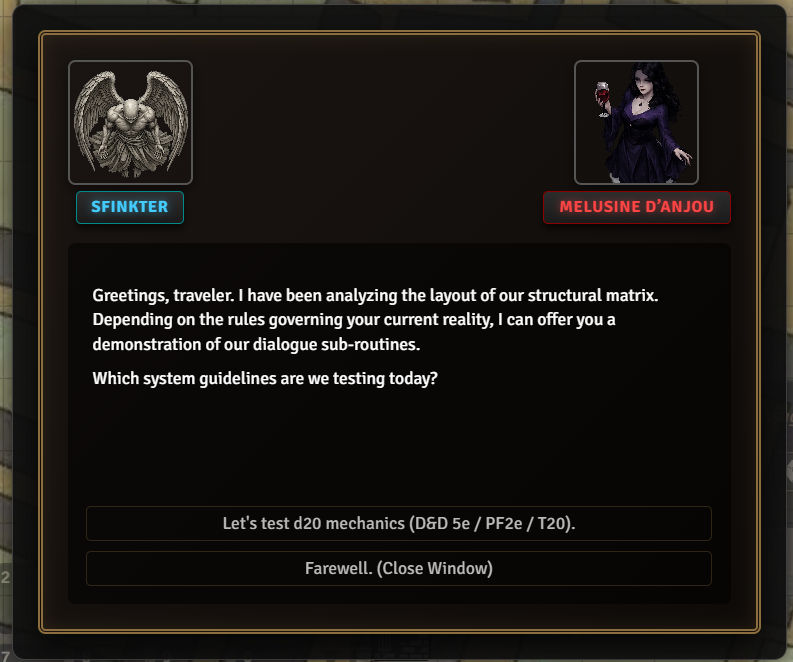
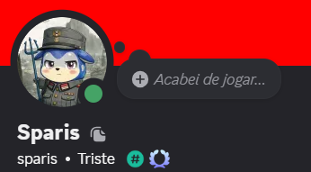

---

# 📖 README.md

```markdown
# RPG Dialogue System v1.0.0

A comprehensive, immersive, video game-style interactive dialogue system for NPCs in Foundry VTT (v14+). Transform your campaign's narratives into branching interactive stories with audio integration and automated skill checks.

Developed by **Sparis**.

## ✨ Features

*   **Branching Choices:** Create complex dialogue trees easily using standard hyperlinks.
*   **Multi-System Skill Checks:** Built-in support for automated rolling in **D&D 5e**, **Pathfinder 2e** and **Tormenta 20**.
*   **Dynamic Audio:** Embed voice lines or sound effects that play automatically when a dialogue page opens.
*   **Item Interactions:** Reward players with items or demand items from their inventory to progress the story.
*   **Proximity Validation:** Players must be within 3.5 grid squares to talk to an NPC.


## 🚀 How to Use (Step-by-Step)

### 1. The Setup
1. Create a Journal Folder named exactly: `Dialogue de NPCs`.
2. Inside this folder, create a Journal Entry. The name of the Journal **must match the NPC's Actor name exactly** (e.g., if your NPC Actor is named `Old Wizard`, the Journal must be named `Old Wizard`).
3. Players can trigger the dialogue window by **Targeting** the NPC token (Press T).

### 2. Writing the Dialogue Trees
Each **Page** inside the NPC's Journal represents a single dialogue screen. 
*   The first page should be named **`inicio`** (or be the very first page in the journal).
*   To create player choices/options, you use **Links** pointing to other pages in the same journal.

## 🛠️ Advanced Text Formatting (HTML Data Attributes)

When editing a Journal Page in HTML mode, you can add special `data-` attributes to your links (`<a>` tags) to trigger advanced mechanics.

### 🎲 1. Skill Checks (Multi-System)
To force a player to make a skill check to unlock a path, format your link like this:
```html
<a data-proximo-id="Sucess_Subtorrano" data-trigger="skill-check" data-pericia="athletics" data-cd="15">Attempt to force the iron gate (Athletics DC 15)</a>

```



* **How it works:** If the player succeeds, they go to the page named `Sucess_Subtorrano`. If they fail, the system automatically redirects them to a page named `Sucess_Subtorrano_fail`.


### ⚔️ 2. Triggering Combat

To immediately end the conversation and roll initiative:

```html
<a data-proximo-id="fechar" data-trigger="combat">Draw your weapon and attack!</a>

```

### 🎁 3. Giving Items (Rewards)

To give an item from the global Item Directory to the player:

```html
<a data-proximo-id="Getting" data-trigger="receive-item" data-item-id="ID_OR_NAME_OF_ITEM" data-quantity="1">Accept the magical ring.</a>

```

### 🔑 4. Demanding Items (Quest Requirements)

To check if a player has an item, remove it from their inventory, and advance:

```html
<a data-proximo-id="Porta_Aberta" data-trigger="demand-item" data-item-id="Iron Key" data-quantity="1">Hand over the Iron Key.</a>

```

* *Note:* If the player doesn't have the item or the required quantity, a warning will pop up and the dialogue won't progress.

### 🎵 5. Adding Audio/Voice Lines

Simply insert a standard Foundry audio element anywhere inside the Journal Page text. The module will automatically extract it, hide the ugly player, and play the sound when the text begins typing:

```html
<audio src="modules/rpg-dialogue-system/sounds/voice_line_01.mp3"></audio>

```

 
---

## 🚪 Ending a Conversation

To close the dialogue window cleanly, create a link pointing to `"close"`:

```html
<a data-proximo-id="close">Goodbye.</a>

```

## Bug Reporting
I'm sure there are lots of issues with it.  It's very much a work in progress.
Please feel free to contact me on discord if you have any questions or concerns. 



## Support

If you feel like being generous, stop by my <a href="https://ko-fi.com/sparis">Ko Fi</a>.  

Not necessary but definitely appreciated.

## License
This Foundry VTT module, writen by Sparis, is licensed under [GNU GPLv3.0](https://www.gnu.org/licenses/gpl-3.0.en.html), supplemented by [Commons Clause](https://commonsclause.com/).

This work is licensed under Foundry Virtual Tabletop [EULA - Limited License Agreement for module development v 0.1.6](http://foundryvtt.com/pages/license.html).

